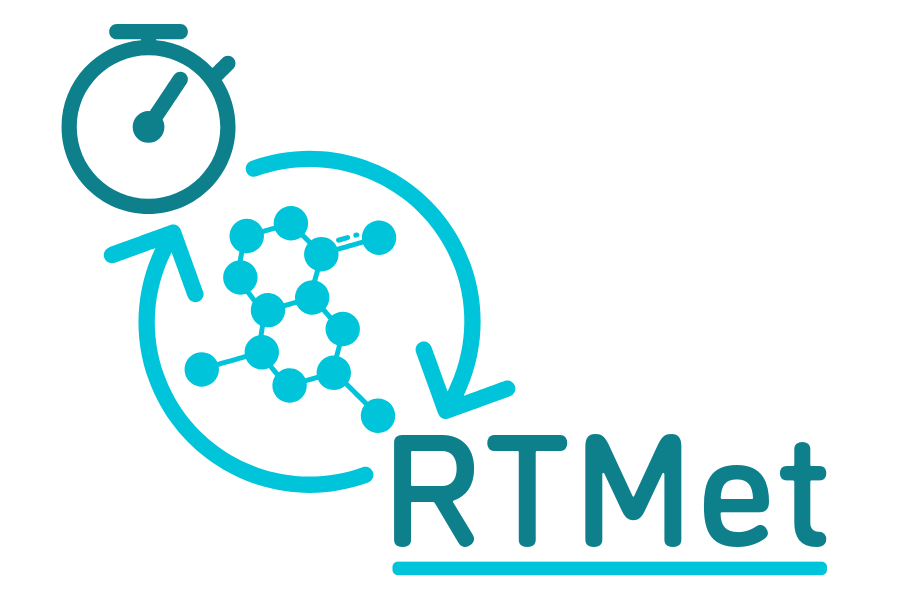

.. RTMet documentation master file, created by
   sphinx-quickstart on Wed May 22 16:20:03 2024.
   You can adapt this file completely to your liking, but it should at least
   contain the root `toctree` directive.

=================================
Welcome to RTMet's documentation!
=================================

What is RTMet ?
===============

**RTMet is a scientific software which aims to facilitate real-time monitoring of metabolites and
reaction rates in a bioreactor.**

At its core, it is a data pipeline for targeted metabolomics that automatically processes raw data
coming from a mass spectrometer, find metabolites, estimate fluxes, and send a feedback command to
the bioreactor.

The main goals are:
   - Allowing researchers and engineers to monitor in real time what is happening in the bioreactor,
     at the chemical level.
   - Better control over the growth of micro-organisms and the bioprocesses at play, by automatically
     changing the bioreactor parameters.

Features
========

- Automatically fetch :file:`.raw` files coming from the mass spectrometer. 
- Process :term:`FIA-HRMS` data to find metabolites, estimate their concentration and reaction rates.
- Visualize the results in real-time.

Is RTMet for you ?
==================

For using RTMet, a few assumptions must be met:
   - The data must be produced by `flow injection analysis`_ (FIA) coupled with high-resolution mass
     spectrometry (HRMS).
   - Your data represents a time series of raw spectra.

If you want to use RTMet for real-time monitoring, there are a few additional requirements:
   - Have automated sampling from the bioreactor and data acquisition using the mass spectrometer.
   - Setup a connection or automatically transfer files from the mass spectrometer to the server where
     RTMet is running.
   - Have a running InfluxDB instance to store and visualize the results.

.. toctree::
   :maxdepth: 2
   :caption: Table of Contents

   getting_started/index
   user_guide/index
   reference/index
   development/index
   glossary
   contributing
   license

.. Indices and tables
   ==================

   * :ref:`genindex`
   * :ref:`modindex`
   * :ref:`search`

.. External References:
.. _flow injection analysis: https://en.wikipedia.org/wiki/Flow_injection_analysis
