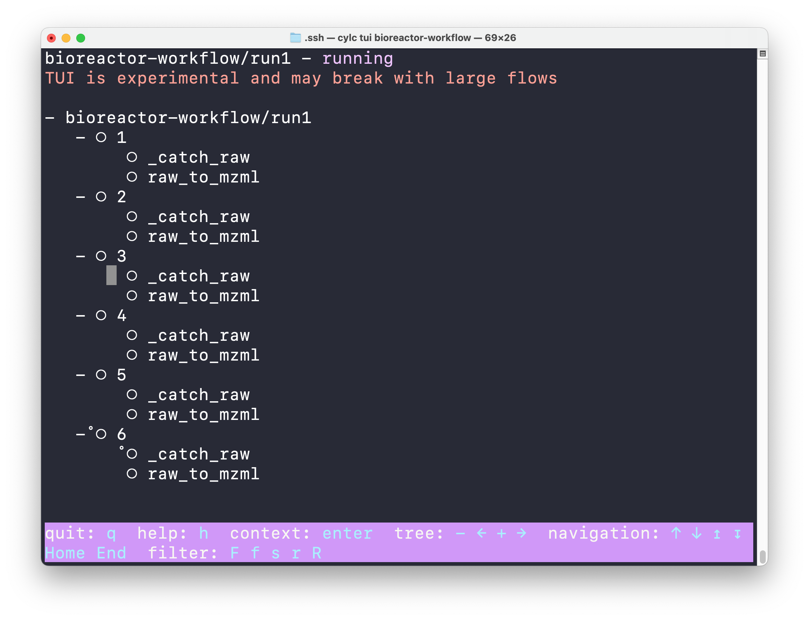
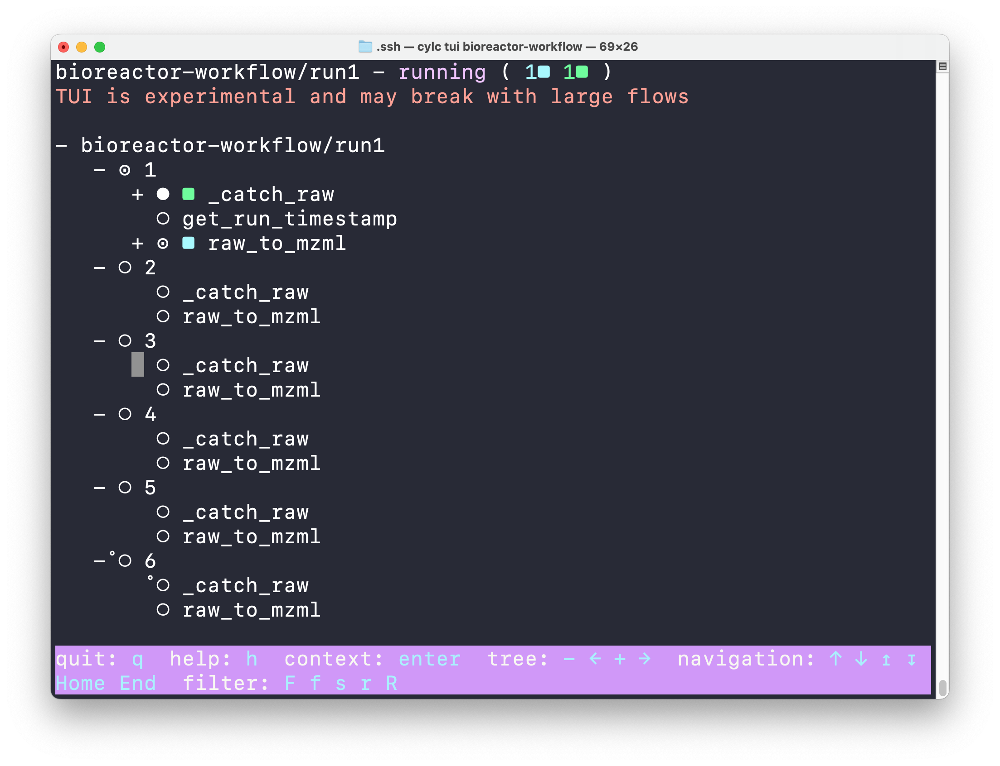
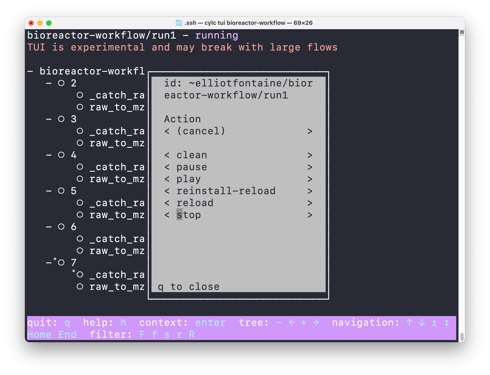
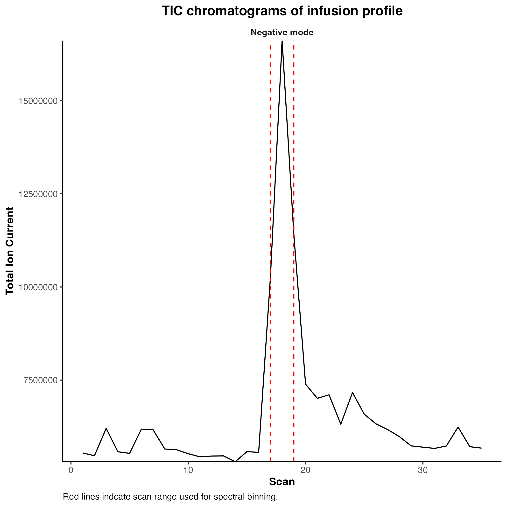

Tutorial
========

.. role:: bash(code)
   :language: bash

In this tutorial, we'll see how RTMet's workflow can automatically ingest and process .raw files. You'll be using the command line, so we assume you are at least familiar with it.

If you don't have RTMet installed already, see how to do that :ref:`here <installing-the-workflow>`.

Creating a workflow run
-------------------------

Open your Terminal. We'll start by making sure you don't have any Conda environment activated, and that you can access the :command:`cylc` command.

.. code-block:: bash

    for i in $(seq ${CONDA_SHLVL}); do conda deactivate; done
    cylc help

.. note::

    If you get an error, verify that the :ref:`wrapper script <setting-up-cylc-and-wrapper>` was correctly set up.

Now, install a runnable copy of the workflow.

.. code-block:: bash

    cylc install bioreactor-workflow
    # INSTALLED bioreactor-workflow/run1 from (...)/cylc-src/bioreactor-workflow

You should now have an existing :term:`run directory` at :file:`~/cylc-run/bioreactor-workflow/run1`.

Right now, it isn't active. Let's change that by running :

.. code-block:: bash

    cylc play bioreactor-workflow
    #  ▪ ■  Cylc Workflow Engine 8.2.4
    #  ██   Copyright (C) 2008-2024 NIWA
    # ▝▘    & British Crown (Met Office) & Contributors

    # 2024-06-17T11:37:56+02:00 INFO - Extracting job.sh to cylc-run/bioreactor-
    # workflow/run1/.service/etc/job.sh
    # bioreactor-workflow/run1: your-computer.local PID=27143

Make sure the workflow is now running with the :command:`cylc scan` command. It should return the name of the run.

We can monitor what the workflow is doing by running :command:`cylc tui bioreactor-workflow`, which opens Cylc's Terminal User Interface (TUI).

You can see :term:`cycles <cycle>` and :term:`tasks <task>` ordered in a tree-like fashion. But right now, nothing is happening. Let's supply some .raw files for the workflow to ingest.

Processing .raw files
---------------

Inside the :term:`run directory` you made, you can find a :file:`raws/` subdirectory, which the workflow is monitoring for input files.

For the purpose of the tutorial, let's `download <https://download-directory.github.io/?url=https%3A%2F%2Fgithub.com%2FMetaboHUB-MetaToul-FluxoMet%2FRTMet%2Ftree%2Fmain%2Ftest%2Ftutorial_raws>`_ some Thermo .raw files from RTMet's repository. Their numbering follows the order in which the samples were extracted and analysed, and so it constitute a time series.

The first one is named :file:`std_30sec_CarboAmmo_10mM_01.raw`. Copy it inside :file:`raws/`. After a few seconds, the workflow run starts processing it.

Now, copy :file:`std_30sec_CarboAmmo_10mM_03.raw` (_03 !) to :file:`raws/`. You'll see that the file is processed in cycle nº3, even though it's the second file added to the input directory.

Finally, copy the 3 remaining files. The should start being processed in parallel.

Once it is done, move your cursor in the TUI with :kbd:`↑`/:kbd:`↓` until you reach the first line (**bioreactor-workflow/run1**) and press :kbd:`Enter`. It should open a contextual menu. Move the cursor to **stop** or click on it. This will shut down the workflow run and close the TUI.

Viewing results
---------------

Still inside the run directory, there is a :file:`share/` subdirectory. This is were you'll find the results. Go in :file:`./cycle/1/dataflow` and open :file:`std_30sec_CarboAmmo_10mM_01.matches.csv`. It's a table containing identified metabolites in the first sample.

.. table:: matched metabolites table
    :widths: auto
    :align: center

    +--------------------------+-------+---------------+-------------+------------+-------------+-----------+-------------+
    | datetime                 | cycle | instrument_id | isobaric_id | feature_mz | feature_pol | delta_ppm | intensity   |
    +==========================+=======+===============+=============+============+=============+===========+=============+
    | 2023-06-21T17:30:53.439Z | 1     | orbitrap_01   | acetate     | 59.01394   | n           | 1.52507   | 1249.25155  |
    +--------------------------+-------+---------------+-------------+------------+-------------+-----------+-------------+
    | 2023-06-21T17:30:53.439Z | 1     | orbitrap_01   | propionate  | 73.02959   | n           | 1.23238   | 814.97559   |
    +--------------------------+-------+---------------+-------------+------------+-------------+-----------+-------------+
    | 2023-06-21T17:30:53.439Z | 1     | orbitrap_01   | pyruvate    | 87.00872   | n           | -0.57465  | 39195.57292 |
    +--------------------------+-------+---------------+-------------+------------+-------------+-----------+-------------+
    |                                                         ...                                                         |
    +---------------------------------------------------------------------------------------------------------------------+

Go in :file:`./cycle/1/qc` to view some quality control results. Open :file:`std_30sec_CarboAmmo_10mM_01.infusion_scans.png`. It represents the Total Ions Count and which scans were selected as the sample injection.

Deleting the workflow run
-------------------------

You can now delete :file:`bioreactor-workflow/run1`. To do it properly, run :command:`cylc clean bioreactor-workflow/run1`. It will remove the :term:`run directory` with all its files.

